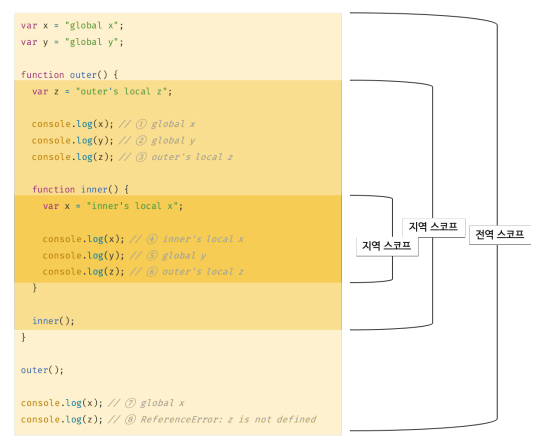
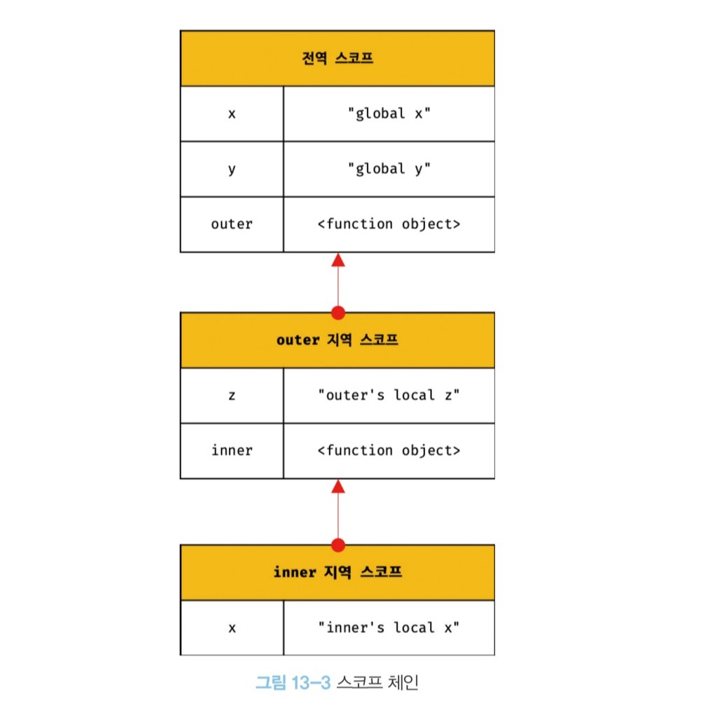

# 스코프

### 스코프 정의

- 자바스크립트를 포함한 모든 프로그래밍 언어의 기본적이며 중요한 개념!
- 함수의 매개 변수는 함수 몸체 내부에서만 참조할 수 있고 함수 몸체 외부에서는 참조할 수 없다고 했다. 이것은 매개 변수를 참조할수 있는 유효범위, 즉 매개변수의 스코프가 함수 몸체 내부로 한정되기 때문이다.
- 모든 식별자(변수 이름, 함수 이름, 클래스 이름 등 ) 는 자신이 선언된 위치에 의해 다른 코드가 식별자 자신을 참조할 수 있는 유효 범위가 결정된다 -> 스코프는 식별자가 유효한범위!

식별자 결정(identifier resolution) : 자바스크립트 엔진은 이름이 같은 두개의 변수 중에서 어떤 변수를 참조해야 할 것인지를 결정해야한다!

"코드가 어디서 실행되며 주변에 어떤 코드가 있는지" 를 렉시컬 환경이라가 부른다.
코드의 문맥(content)은 렉시컬 환경으로 이뤄진다. 이를 구현한 것이 "실행 컨텍스트"이며, 모든 코드는 실행 컨텍스트에서 평가되고 실행된다.

---

### 스코드 종류

- 코드는 전역 global 과 지역 local 으로 구분할수있다.

전역 스코프 : 전역에서 선언된 변수는 전역 스코프를 갖는 전역 변수이다. 
지역 스코프 : 지역에서 선언된 변수는 지역 스코프를 갖는 지역 변수이다. 

전역이란 코드의 가장 바깥 영역을 말한다. 전역은 전역 스코프를 만든다. 전역에 변수를 선언하면 전역 스코프를 갖는 변역 변수가 된다.
전역 변수는 어디서든지 참조할 수 있다.

지역이란 함수 몸체 내부를 말한다. 지역은 지역스코프를 만든다. 지역에 변수를 선언하면 지역 스코프를 갖는 직역변수가 된다.

---

### 스코프 체인

- 스코프 체인은 계층적으로 연결된것!
  

변수를 참조할때 자바스크립트 엔진은 스코프 체인을 통해 변수를 참조하는 코드의 스코프에서 시작하여 상위 스코프 방향으로 이동하며 선언된 변수를 검색(identifier resolution)이라 한다.
상위 스코프에서 선언한 변수를 하위 스코프에서도 참조할수있다.

렉시컬 환경 : 스코프 체인은 실행 컨텍스트의 렉시컬 환경을 단방향으로 연결한 것이다. 전역 렉시컬 환경은 코드가 로드되면 곧바로 생성되고 함수의 렉시컬 환경은 함수가 호되면 곧바로 생성된다!

- 스코프 체인으로 연결된 스코프의 계층적 구조는 부자 관계로 이뤄진 상속과 유사하다. 상속을 통해 부모의 자산을 자식이 자유롭게 사용할 수 있지만 자식의 자산을 부모가 사용할 수는 없다. 스코프체인도 마찬가지개념이다!

함수레벨 스코프

- if, for , while, try/catch 이런 코드블록이 지역 스코프를 만드는데 이런 특성을 블록 레벨 스코프라고한다.!

---

### 렉시컬 스코프

1. 동적 스코프(dynamic scope) : 함수를 정의하는 시점에는 함수가 어디서 호출 될지 알 수 없다. 따라서 함수가 호출되는 시점에 동적으로 상위 스코프를 결정해야 하기 때문에 동적 스코프라고 부른다.
2. 렉시컬 스코프(lexical scope) : 정적 스코프 라고도 불린다. 동적 스코프 방식처럼 상위 스코프가 동적으로 변하지 않고 함수 정의가 평가되는 시점에 상위 스코프가 정적으로 결정되기 때문에 정적 스코프라고도 불린다. (대부분의 프로그래밍 언어는 렉시컬 스코프를 따른다!)

- 자바스크립트는 렉시컬 스코프를 따르므로 함수를 어디서 호출했는지가 아니라 함수를 어디서 정의했는지에 따라 상위 스코프를 결정한다. 함수가 호출된 위치는 상위 스코프 결정에 어떠한 영향도 주지 않는다. 함수의 상위 스코프는 언제나 자신이 정의된 스코프다.
- 함수의 상위 스코프는 함수 정의가 실행될 떄 정적으로 결정된다. 함수 정의(함수 선언문 또는 함수표현식) 실행되어 생성된 함수 객체는 이렇게 결정되 상위 스코프를 기억한다. 함수가 호출될 때마다 함수의 상위 스코프를 참조할 표요가 있기 때문이다.
