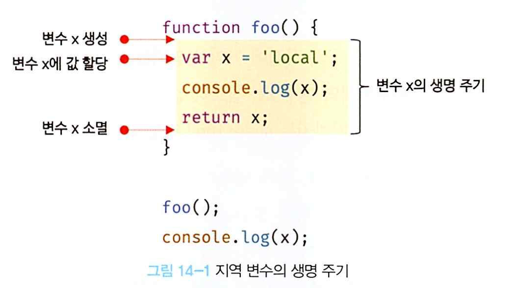

# 전역 변수의 문제점

► 전역 변수의 무분별한 사용은 위험!

### 변수의 생명주기

변수는 선언에 의해 생성되고 할당을 통해 값을 갖는다.
생명주기가 없다면 한번 선언된 변수는 프로그램을 종료하ㅏ지 않는 한 영원히 메모리 공간을 점유하게 된다.
지역 변수의 생명 주기는 함수의 생명 주기와 일치한다!


- 변수는 하나의 값을 저장하기 위해 확보한 메모리 공간 자체 또는 그 메모리 공간을 식별하기 위해 붙인 이름이다. 따라서 변ㅅ수의 생명주기는 메모리 공간이 확보 된 시점부터 메모리 공간이 해제되어 가용 메모리 풀에 반환되는 시점까지!

```js
var x = "global";

function foo() {
  console.log(x); //(1)
  var x = "local";
}

foo();
console.log(x); //global
```

ex)<br>
foo 함수 대부에서 선언된 지역 변수 x는 (1)의 시점에 이미 선언되었고 undefined로 초기화되어 있다. 따라서 전역 변수 x를 참조하는 것이 아니라 지역 변수 x를 참조해 값을 출력한다. 즉, 지역 변수는 함수 전체에서 유효하다. 단, 변수 할당문이 실행되기 이전까지는 undefined값을 갖는다.

이처럼 호이스팅은 스코프를 단위로 동작한다.

---

### 전역 변수의 문제점

암묵적 결합

- 전역 변수를 선언한 의도는 전역, 즉 코드 어디서든 참조하고 할당할 수 있는 변수를 사용하겠다는 것이다.
  이는 모든코드ㅡ가 전역 변수를 참조하고 변경할수있는 암묵적 결합을 허용하는 것이다.

긴 생명주기

- 전역 변수는 생명주기가 길다. 따라서 메모리 리소스도 오랜 기간 소비한다. 또한 전역 변수의 상태를 변경 할 수 있는 시간도 길고 기회도 많다.
  - 지역 변수는 전역 ㅂㅂㅂ변수보다 생명주기 훨씬 짧다. 크지 않은 함수의 지역 변수는 생존 시간이 극히 짧다. 따라서 지역 변수의 상태를 변경할 수 있는 시간도 짧고 기회도 적다.
  - 전역 변수보다 상태 변경에 의한 오류가 발생할 확률이 작다는 것을 의미 or 메모리 리소스도 짧은 기간만 소비

스코프 체인상에서 종점에 존재

- 전역 변수는 스코프 체인 상에서 종점에 존재한다. 이는 변수를 검색할 때 전역 변수가 가장 마지막에 검색된 다는 것을 말한다. 즉 전역 변수의 검색 속도가 가장 느리다. 검ㅁ색 속도의 차이는 긎ㅈ다지 크지 않지만 속도의 차이는 분명히 있다.

네임스페이스 오염

- 자바 스크립트의 가장 큰 문제점 중 하나는파일이 분리되어 있다 해도 하나의 전역 스코프를 공유한다는 것이다. 따라서 다른 파일 내에서 동일한 이름으로 명명된 전역 변수나 전역 함수가 같은 스코프 내에 존재할 경우 예상치 못한 결과를 가져올 수 있다.

### 전역 변수의 사용을 억제 하는 방법

- 전역 변수의 무분별한 사용은 위험하다. 전역 변수를 반드시 사용해야 할 이유를 찾지 못한다면 지역 변수를 사용해야한다. 변수의 스코프는 좁을수록 좋다.
